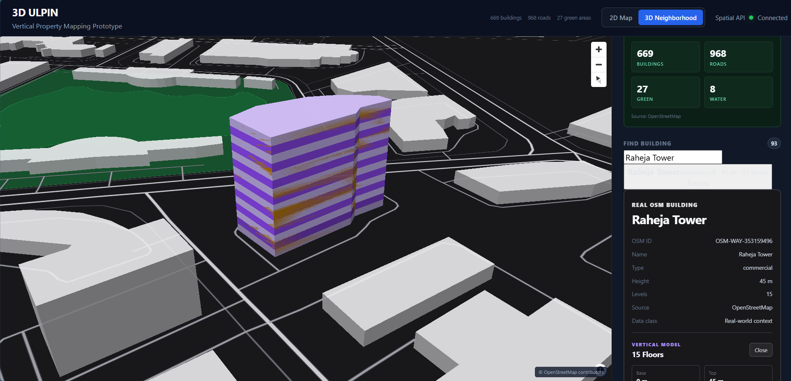

# 3D ULPIN

**A prototype spatial system for representing and resolving vertical property space.**

> Architecture for a city. Data for a neighborhood.

3D ULPIN explores how conventional 2D land and building information can be extended into a spatial model capable of representing vertically stacked property entities.

The prototype combines real urban geometry, explicit vertical extents, provenance-aware spatial entities, PostGIS spatial operations, and an interactive 2D/3D interface.

At its core, the system demonstrates a simple spatial primitive:

```text
resolve(longitude, latitude, elevation)
                    ↓
            spatial identity
```

Given a physical `(X, Y, Z)` coordinate, the prototype can determine the real building and modeled vertical property entity containing that point.

---

## Prototype



The current prototype uses **Bandra Kurla Complex (BKC), Mumbai** as its real-world urban environment.

It supports:

- real OpenStreetMap neighborhood geometry
- real building footprints and metadata
- interactive building search
- 2D and 3D neighborhood visualization
- vertically bounded floor entities
- provenance-aware spatial information
- deterministic `(X, Y, Z) → property identity` resolution

**Raheja Tower** is used as the flagship vertical-property demonstration.

---

# What Is Being Built?

Traditional cadastral and land-information systems primarily describe property horizontally.

A parcel naturally fits a two-dimensional representation:

```text
┌──────────────────────────────┐
│                              │
│            PARCEL            │
│                              │
└──────────────────────────────┘

          X / Y
```

Dense urban property does not.

Multiple independently meaningful spaces can occupy the same horizontal footprint:

```text
                 same X / Y
                     │
          ┌────────────────────┐
          │      Floor 15      │
          ├────────────────────┤
          │      Floor 14      │
          ├────────────────────┤
          │        ...         │
          ├────────────────────┤
          │      Floor 02      │
          ├────────────────────┤
          │      Floor 01      │
          └────────────────────┘
                     │
                     Z
```

Longitude and latitude alone cannot distinguish those spaces.

3D ULPIN investigates a model in which property entities retain both:

```text
horizontal geometry
        +
vertical extent
        ↓
3D spatial identity
```

The intended hierarchy is:

```text
PARCEL
   │
   └── BUILDING
          │
          ├── FLOOR
          │      │
          │      └── UNIT
          │
          ├── FLOOR
          │
          └── ...
```

Each entity can preserve:

```text
identity
geometry
vertical extent
parent relationship
semantic type
provenance
derivation method
verification status
```

The visualization is an interface to this model.

It is not the model itself.

---

# Core Prototype Result

The current prototype can resolve a physical 3D coordinate into a vertical property hierarchy.

For example:

```text
INPUT

longitude = 72.86295
latitude  = 19.06090
elevation = 22.5 m
```

The spatial engine resolves:

```text
Raheja Tower
OSM-WAY-353159496
        │
        └── RAHEJA-F08
            Floor 8
            Z = [21 m, 24 m)
```

In other words:

```text
(X, Y, Z)
    ↓
spatial identity
```

This is the primary technical primitive demonstrated by the prototype.

---

# Real-World Demonstration

## BKC, Mumbai

The prototype contains real urban context from **OpenStreetMap** for Bandra Kurla Complex.

The spatial database contains neighborhood entities including:

```text
BKC
│
├── Buildings
├── Roads
├── Parks
└── Water / public spatial features
```

The data is ingested into PostGIS through a reproducible OSM pipeline and exposed to the frontend through FastAPI.

The browser does not own a separate copy of the spatial model.

```text
OpenStreetMap
      ↓
Ingestion Pipeline
      ↓
PostGIS
      ↓
FastAPI
      ↓
GeoJSON
      ↓
MapLibre
```

---

# Raheja Tower

A real BKC building is used to demonstrate vertical property representation.

```text
Name
Raheja Tower

Building ID
OSM-WAY-353159496

OSM ID
353159496

Type
commercial

Mapped height
45 m

Mapped levels
15

Source
OpenStreetMap
```

Its horizontal footprint is real OpenStreetMap geometry.

The prototype then derives a deterministic vertical model from its mapped height and level count.

```text
45 m
÷
15 levels
=
3 m per modeled floor
```

Result:

```text
F15   [42, 45)
F14   [39, 42)
F13   [36, 39)
...
F03   [ 6,  9)
F02   [ 3,  6)
F01   [ 0,  3)
```

The resulting entities are identified as:

```text
RAHEJA-F01
RAHEJA-F02
...
RAHEJA-F15
```

---

# Provenance Matters

A central design constraint is that the system must distinguish **what is known** from **what is inferred or generated**.

The prototype uses four provenance classes:

```text
authoritative
real
derived
synthetic
```

### Real

Real-world information obtained from a non-authoritative geospatial source.

Example:

```text
Raheja Tower

source_type = real
source_name = OpenStreetMap
```

Its OSM footprint, name, building type, mapped height, and mapped level count belong to this category.

### Derived

Information computationally generated from other spatial information.

Example:

```text
RAHEJA-F08

source_type = derived

derivation_method =
Derived from OpenStreetMap building footprint,
height, and building:levels

verification_status = unverified
```

The prototype does **not** claim that these floor geometries are official cadastral floor records.

### Synthetic

Information deliberately created for development or demonstration.

The original P001/B001/F001/U101 development property belongs to this category.

### Authoritative

Reserved for information obtained from an appropriate official or cadastral source.

The current prototype does not claim that its OSM data is authoritative cadastral information.

---

# ULPIN Position

ULPIN/Bhu-Aadhaar is an official land-parcel identification system administered through government land-record systems.

This project does **not** claim to issue official ULPIN identifiers.

The prototype distinguishes:

```text
Official ULPIN
      │
      └── Government-issued parcel identity


Prototype Spatial Identity
      │
      ├── Building identity
      ├── Floor identity
      └── Unit identity
```

Identifiers such as:

```text
P001
B001
RAHEJA-F08
U101
```

are internal prototype identifiers unless explicitly documented otherwise.

---

# Spatial Representation

The system deliberately avoids treating property merely as an opaque 3D mesh.

A vertical entity can instead be represented conceptually as:

```text
SpatialEntity {
    id
    entity_type
    parent_id

    footprint

    z_min
    z_max

    source_type
    source_name
    derivation_method
    verification_status
}
```

A floor volume therefore becomes:

```text
2D footprint
      ×
vertical interval
      ↓
3D spatial volume
```

This representation remains useful independently of the renderer.

---

# Vertical Boundary Semantics

Vertical entities use **half-open intervals**:

```text
[z_min, z_max)
```

Equivalent to:

```text
z_min <= z < z_max
```

For example:

```text
Floor 07 = [18, 21)
Floor 08 = [21, 24)
Floor 09 = [24, 27)
```

Therefore:

```text
20.999999 → Floor 07
21.000000 → Floor 08

23.999999 → Floor 08
24.000000 → Floor 09
```

This prevents adjacent floors from simultaneously claiming the same boundary coordinate.

The behavior is covered by automated tests.

---

# Spatial Resolution Engine

The prototype exposes:

```http
GET /spatial/resolve
```

Example:

```text
/spatial/resolve?lon=72.86295&lat=19.06090&z=22.5
```

Example response:

```json
{
  "point": {
    "lon": 72.86295,
    "lat": 19.0609,
    "z": 22.5
  },

  "building": {
    "building_id": "OSM-WAY-353159496",
    "name": "Raheja Tower",
    "building_type": "commercial",
    "height_m": 45.0,
    "levels": 15,
    "source_type": "real",
    "source_name": "OpenStreetMap"
  },

  "floor": {
    "floor_id": "RAHEJA-F08",
    "floor_number": 8,
    "z_min_m": 21.0,
    "z_max_m": 24.0,
    "source_type": "derived",
    "verification_status": "unverified"
  },

  "hierarchy": [
    "OSM-WAY-353159496",
    "RAHEJA-F08"
  ]
}
```

Horizontal containment is resolved using PostGIS geometry operations.

Vertical containment is resolved using explicit Z intervals.

---

# Architecture

```text
                         USER
                           │
                           ▼
                 ┌───────────────────┐
                 │ React / TypeScript│
                 └─────────┬─────────┘
                           │
                           ▼
                 ┌───────────────────┐
                 │     MapLibre      │
                 │                   │
                 │ 2D neighborhood   │
                 │ 3D extrusions     │
                 │ building search   │
                 │ vertical inspect  │
                 └─────────┬─────────┘
                           │
                     HTTP / GeoJSON
                           │
                           ▼
                 ┌───────────────────┐
                 │      FastAPI      │
                 │                   │
                 │ property API      │
                 │ neighborhood API  │
                 │ spatial API       │
                 └─────────┬─────────┘
                           │
                           ▼
                 ┌───────────────────┐
                 │      PostGIS      │
                 │                   │
                 │ geometry          │
                 │ vertical ranges   │
                 │ relationships     │
                 │ provenance        │
                 └─────────┬─────────┘
                           │
              ┌────────────┴────────────┐
              │                         │
              ▼                         ▼
       OpenStreetMap             Prototype-derived
        real context             vertical entities
```

---

# Technology Stack

### Frontend

- React
- TypeScript
- Vite
- MapLibre GL JS

### Backend

- Python
- FastAPI
- psycopg

### Spatial Infrastructure

- PostgreSQL 17
- PostGIS 3.5
- GEOS
- PROJ

### Data Pipeline

- Python
- OpenStreetMap
- PostGIS

### Infrastructure

- Docker
- Docker Compose
- Git
- GitHub

---

# Repository Structure

```text
ulpin-3d/
│
├── backend/
│   └── app/
│       ├── main.py
│       ├── database.py
│       │
│       └── routers/
│           ├── parcels.py
│           ├── buildings.py
│           ├── floors.py
│           ├── units.py
│           ├── neighborhood.py
│           └── spatial.py
│
├── database/
│   └── migrations/
│
├── frontend/
│   └── src/
│       ├── App.tsx
│       ├── App.css
│       ├── api.ts
│       │
│       └── components/
│           └── MapViewer.tsx
│
├── pipelines/
│   └── osm/
│       └── ingest.py
│
├── data/
│   ├── raw/
│   ├── intermediate/
│   └── processed/
│
├── docs/
│   └── assets/
│       └── ulpin-3d-prototype.png
│
├── tests/
│   ├── test_api.py
│   └── test_spatial.py
│
├── docker-compose.yml
├── documentation.md
└── README.md
```

---

# Running Locally

The system consists of three runtime components:

```text
PostGIS
FastAPI
React / MapLibre
```

## 1. Start PostGIS

From the repository root:

```powershell
docker compose up -d
```

Verify:

```powershell
docker ps
```

---

## 2. Start FastAPI

Activate the virtual environment:

```powershell
.\.venv\Scripts\Activate.ps1
```

Start the backend:

```powershell
python -m uvicorn backend.app.main:app
```

API:

```text
http://127.0.0.1:8000
```

Swagger:

```text
http://127.0.0.1:8000/docs
```

---

## 3. Start the frontend

In another terminal:

```powershell
cd frontend
npm run dev
```

Open:

```text
http://localhost:5173
```

---

# Demo

A minimal prototype demonstration:

```text
Open application
      ↓
View BKC
      ↓
Search "Raheja"
      ↓
Focus Raheja Tower
      ↓
Inspect real OSM metadata
      ↓
Open vertical model
      ↓
Inspect 15 derived floors
      ↓
Query physical X/Y/Z coordinate
      ↓
Resolve building + floor identity
```

Example query:

```powershell
Invoke-RestMethod -Uri 'http://127.0.0.1:8000/spatial/resolve?lon=72.86295&lat=19.06090&z=22.5'
```

Expected hierarchy:

```text
OSM-WAY-353159496
        ↓
RAHEJA-F08
```

---

# Testing

Run the spatial tests:

```powershell
python -m pytest tests/test_spatial.py -v
```

The tests verify:

- real building resolution
- floor resolution
- vertical boundary behavior
- ground-floor behavior
- top-floor behavior
- hierarchy output
- provenance preservation
- outside-building behavior
- invalid coordinate rejection

The spatial-resolution test suite passes at the current prototype checkpoint.

---

# What the Prototype Proves

The prototype demonstrates five things.

### 1. Real urban geometry can form the context of a vertical property system.

BKC is represented using real OpenStreetMap data stored in PostGIS.

### 2. Real buildings can become independently addressable spatial entities.

Buildings can be searched, focused, inspected, and queried.

### 3. Vertically stacked property space can be represented explicitly.

Raheja Tower is represented as 15 vertically bounded floor entities.

### 4. Physical 3D coordinates can resolve to property identities.

The spatial engine can answer:

```text
What modeled property space contains this point?
```

using longitude, latitude, and elevation.

### 5. Provenance can survive the complete spatial pipeline.

The system preserves distinctions between:

```text
real
derived
synthetic
authoritative
```

from the database through the API and into the user interface.

---

# What This Prototype Does Not Claim

This is an engineering prototype.

It does not claim that:

- OpenStreetMap geometry is authoritative cadastral geometry.
- Raheja Tower's derived floor boundaries are official floor records.
- `RAHEJA-F01`–`RAHEJA-F15` are government-issued identifiers.
- the system contains authoritative ownership information.
- the prototype issues official ULPINs.
- the prototype represents legal title.
- all OSM building heights or level counts are complete or verified.
- the system is production-ready cadastral infrastructure.

The distinction between real, derived, synthetic, and authoritative information is intentional.

---

# Current Scope

Implemented:

```text
PostGIS spatial model              ✓
Parcel / building / floor schema   ✓
Provenance model                   ✓
Real BKC context                   ✓
OSM ingestion                      ✓
FastAPI spatial APIs               ✓
React application                  ✓
MapLibre 2D                        ✓
MapLibre 3D extrusions             ✓
Building search                    ✓
Building focus                     ✓
Raheja Tower vertical model        ✓
resolve(X, Y, Z)                   ✓
Spatial correctness tests          ✓
```

Outside the current prototype:

```text
official cadastral integration
official ULPIN generation
real ownership records
real floor plans
real unit boundaries
general 3D topology
adjacency graphs
authorization
city-scale vector tiling
production deployment
```

---

# Engineering Principles

1. Spatial correctness before visual complexity.
2. The database and backend remain the source of truth.
3. Preserve semantic spatial entities rather than reducing everything to meshes.
4. Maintain explicit provenance.
5. Never fabricate authoritative cadastral information.
6. Keep derived data distinguishable from source data.
7. Prefer deterministic spatial behavior.
8. Test boundary semantics.
9. Keep renderer state separate from spatial truth.
10. Build the smallest primitive that proves the system's thesis.

The core principle is:

> **The visualization is not the spatial model. It is an interface for inspecting the spatial model.**

---

# Development History

A detailed chronological engineering walkthrough is available in:

```text
documentation.md
```

It covers the progression from:

```text
research
   ↓
PostGIS domain model
   ↓
synthetic vertical property
   ↓
FastAPI
   ↓
MapLibre
   ↓
Cesium experimentation
   ↓
real neighborhood ingestion
   ↓
BKC
   ↓
Raheja Tower
   ↓
vertical property model
   ↓
spatial resolution engine
```

---

# Prototype Status

**Prototype:** Complete for current scope  
**Geography:** Bandra Kurla Complex, Mumbai  
**Flagship property:** Raheja Tower  
**Spatial primitive:** `resolve(longitude, latitude, elevation)`  
**Data model:** Real + derived + synthetic with explicit provenance

The current prototype is intentionally frozen around one central technical result:

```text
physical 3D coordinate
        ↓
spatial property identity
```

---

# License

To be determined.

OpenStreetMap data is subject to its applicable license and attribution requirements.

Other third-party datasets retain their respective licenses and attribution requirements.